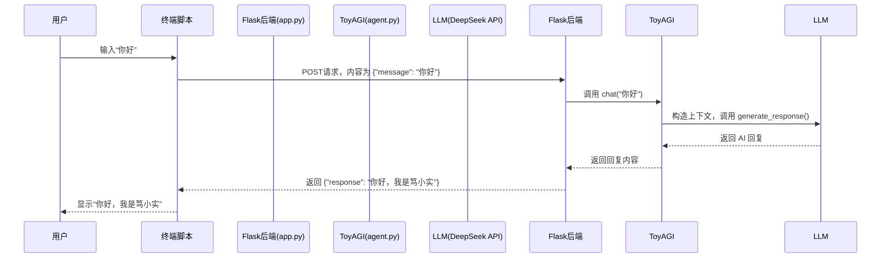

# 1st Docode Club Lab2：AGI核心功能实现

---

## 一、AGI技术介绍

### 1.1 什么是AGI？

AGI（Artificial General Intelligence，通用人工智能）指的是具备人类认知能力的人工智能系统，能够像人类一样灵活、泛化地完成不同领域的任务。

AGI 不依赖于特定任务训练，而能够：

- 理解并生成自然语言、图像、视频等多模态信息
- 学习新技能、解决新问题
- 拥有持续性记忆与自我目标规划能力

AGI 是当前AIGC与LLM技术发展的终极目标，也是学术界和产业界共同探索的前沿方向。

### 1.2 什么是AIGC？

AIGC (人工智能自动生成内容，AI Generated Content)是指利用人工智能技术生成文本、图片、音频、代码等内容。

它从"对数据分析"进化为"实际创作力"，在文字创作（ChatGPT）、图像生成（Stable Diffusion）、代码生成（GitHub Copilot）等方面得到应用。

### 1.3 什么是LLM？

大型语言模型（LLM，Large Language Model）是AIGC的核心技术，通过大量文本进行预训练，可以生成有调性、有评价、有结构的内容。

常见LLM：

* OpenAI GPT-4 / ChatGPT
* DeepSeek
* Claude
* LLaMA

---

## 二、Prompt工程介绍

### 2.1 Prompt是什么？

Prompt = 给AI一个指令/列表，使它产生预期结果

### 2.2 Prompt 写体格式

1. 身份设定："你是一个专业统计分析师"
2. 第一个消息：用"system" 或 "user"设定对话规则
3. 指定结果格式："以markdown格式输出" "必须使用python代码块"
4. 给出示例：提供既有的input-output对

### 2.3 Prompt 工程经典模式

* Zero-shot: 直接提问
* One-shot: 给一个示例
* Few-shot: 给出3\~5个示例
* Chain-of-thought: 强调分步理解和解题
* ReAct: 给出 "思考+操作" 链

---

## 三、后端服务搭建基础

### 3.1 后端是什么？

后端（Backend）是一个软件系统中**负责处理逻辑、数据、计算与接口的部分**。我们日常使用的网页、App（如微信、B站），它们的页面和操作都依赖后端处理数据，比如：

- 登录验证账号密码 ✅
- 聊天记录的存储与调用 📬
- 点赞、评论的记录和展示 👍

后端的主要职责包括：

- 接收前端发来的请求
- 处理请求（可能涉及数据库、AI模型等）
- 将处理结果返回给前端

### 3.2 后端常见名词解释

| 名词                | 解释                                                         |
| ------------------- | ------------------------------------------------------------ |
| **API**             | 全称 Application Programming Interface，应用程序接口，前后端之间交流的“约定通道”。 |
| **路由 (Route)**    | 指定某个网址（如 `/chat`）对应的后端函数，决定用户访问时触发哪个处理逻辑。 |
| **请求 (Request)**  | 用户发给服务器的信息，如发送一段文字给AI。                   |
| **响应 (Response)** | 服务器返回给用户的信息，如AI的回答。                         |
| **JSON**            | 一种轻量的数据格式，常用来在前后端之间传输结构化数据。       |
| **环境变量 (.env)** | 存储敏感信息或配置信息的文件，如 API 密钥、数据库地址等。    |

### 3.3 Flask 简介

[Flask 官网：https://flask.palletsprojects.com/](https://flask.palletsprojects.com/)

Flask 是一个用 Python 编写的轻量级 Web 框架，常用于快速搭建后端服务。它的特点是：

- 🌱 简单上手，适合初学者和原型开发
- ⚙️ 支持灵活扩展，可连接数据库、AI模型等
- 🔁 提供“请求 -> 响应”的机制，便于构建聊天类服务

在本项目中，我们使用 Flask 来作为后端框架，接收用户输入、调用 AI 模型、返回响应结果。

### 3.4 项目代码结构简介

项目结构与功能说明如下

```bash
DoCode-AGI/
├── app.py                        # 后端主程序，启动 Flask 服务
├── chat_in_terminal.py           # 终端聊天脚本（用户输入 -> AI 回复）
├── config.py                     # 读取环境变量的配置文件
├── requirement.txt               # 依赖库列表（用于 pip install）
├── .env                          # 环境变量文件（需手动添加，如 API 密钥）
│
├── core/                         # 核心模块文件夹
│   ├── llm.py                    # LLM 接口调用（封装 DeepSeek API）
│   ├── agent.py                  # ToyAGI 智能体：管理聊天和任务
│   ├── memory.py                 # 对话记忆模块（存储上下文历史）
│   └── task_manager.py           # 任务管理模块（记录状态与结果）
│
├── readme.md                     # 项目说明文件
```

### 3.5 后端代码执行流程

以聊天为例，当你在终端输入一段文字后：



**核心流程**：

1. 接收用户输入 → Flask 路由触发
2. 构造上下文消息 → `agent.py` 中完成
3. 请求 LLM 获取回答 → `llm.py` 调用 API
4. 保存对话历史 → `memory.py`
5. 返回响应 → 发回终端或前端

---

## 四、实操教程：搭建简单的笃小实ai，并成功对话


## 五、常见问题与解决方法

1. 与笃小实对话中出现

   ```
   Sorry, I encountered an error: ('Connection aborted.', ConnectionAbortedError(10053, '你的主机中的软件中止了一个已建立的连接。', None, 10053, None))
   ```

   解决方法：将网络切换为校园网（再重启程序）

## 六、参考资料与学习资源

1. **Git 学习资源**：
   - [Git 官方文档](https://git-scm.com/doc)
   - [GitHub 使用指南](https://docs.github.com/cn)
   - [Git 简明指南](http://rogerdudler.github.io/git-guide/index.zh.html)
2. **Python 学习资源**：
   - [Python 官方文档](https://docs.python.org/zh-cn/3/)
   - [廖雪峰 Python 教程](https://www.liaoxuefeng.com/wiki/1016959663602400)
   - [Python 编程：从入门到实践（书籍）](https://book.douban.com/subject/35196328/)
3. **数据科学与机器学习资源**：
   - [NumPy 官方文档](https://numpy.org/doc/)
   - [Pandas 官方文档](https://pandas.pydata.org/docs/)
   - [Matplotlib 官方文档](https://matplotlib.org/stable/users/index.html)
4. **在线学习平台**：
   - [LeetCode](https://leetcode.cn/)：算法练习
   - [Coursera](https://www.coursera.org/)：各类课程
   - [DataCamp](https://www.datacamp.com/)：数据科学课程


> # 祝各位在 DoCode 营中学习愉快，掌握实用技能！
